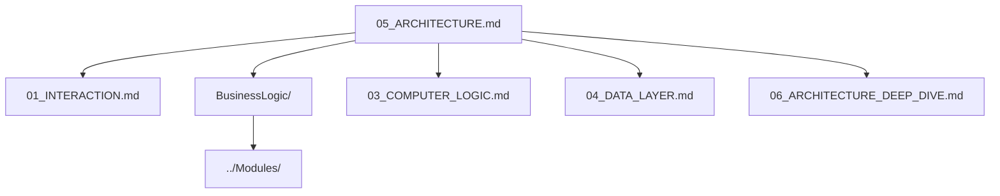

# Architecture

> Technical architecture documentation for Inxtone

**Documents**: 6 + BusinessLogic/ | **Total Lines**: ~4385

## Context Injection Guide

| Task Scenario | Read These Files | Lines |
|---------------|------------------|-------|
| High-level overview | 05_ARCHITECTURE.md | ~745 |
| UI/Interaction | 01_INTERACTION.md | ~248 |
| Business logic | BusinessLogic/Meta.md | ~1400 |
| AI/Search | 03_COMPUTER_LOGIC.md | ~208 |
| Database schema | 04_DATA_LAYER.md | ~848 |
| IPC/State mgmt | 06_ARCHITECTURE_DEEP_DIVE.md | ~697 |
| Module details | ../Modules/Meta.md | varies |

## Documents

| File | Lines | Summary | When to Read |
|------|-------|---------|--------------|
| [01_INTERACTION.md](01_INTERACTION.md) | ~248 | TUI + Web GUI design, routes, shortcuts | UI development |
| [BusinessLogic/](BusinessLogic/Meta.md) | ~1400 | Schemas, rules, templates, workflows | Feature implementation |
| [03_COMPUTER_LOGIC.md](03_COMPUTER_LOGIC.md) | ~208 | AI abstractions, search, concurrency | AI/Search features |
| [04_DATA_LAYER.md](04_DATA_LAYER.md) | ~848 | SQLite schema, migrations, versioning | Database work |
| [05_ARCHITECTURE.md](05_ARCHITECTURE.md) | ~745 | Module design, API contracts, overview | Architecture decisions |
| [06_ARCHITECTURE_DEEP_DIVE.md](06_ARCHITECTURE_DEEP_DIVE.md) | ~697 | IPC, file watching, state management | Advanced topics |

## Reading Order

**Recommended path:**
1. Start with **05_ARCHITECTURE.md** for system overview
2. Pick domain based on task:
   - UI work → 01_INTERACTION.md
   - Features → BusinessLogic/
   - AI/Search → 03_COMPUTER_LOGIC.md
   - Database → 04_DATA_LAYER.md

## Document Notes

### Completed Splits
- ✅ ~~02_BUSINESS_LOGIC.md~~ (1639 lines) → [BusinessLogic/](BusinessLogic/Meta.md) (21 files) — *原文件已删除*

### Pending Splits
These documents are over the 150-line limit and flagged for further splitting:
- 04_DATA_LAYER.md (848 lines) → needs split into Schema/, Migrations/
- 05_ARCHITECTURE.md (745 lines) → needs split into Overview, Modules, API
- 06_ARCHITECTURE_DEEP_DIVE.md (697 lines) → needs split into IPC, State, CLI

---

## See Also

- [../Modules/Meta.md](../Modules/Meta.md) - Service module designs
- [../Core/Technical.md](../Core/Technical.md) - Tech stack reference
- [../Decisions/ADR-0001-tech-stack.md](../Decisions/ADR-0001-tech-stack.md) - Stack decision
