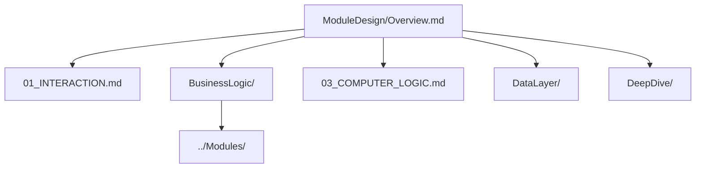

# Architecture

> Technical architecture documentation for Inxtone

**Documents**: 3 files + 4 folders | **Total Lines**: ~4385

## Context Injection Guide

| Task Scenario | Read These Files | Lines |
|---------------|------------------|-------|
| High-level overview | ModuleDesign/Overview.md | ~60 |
| UI/Interaction | 01_INTERACTION.md | ~248 |
| Business logic | BusinessLogic/Meta.md | ~1400 |
| AI/Search | 03_COMPUTER_LOGIC.md | ~208 |
| Database schema | DataLayer/Schema.md | ~150 |
| IPC/State mgmt | DeepDive/IPC.md | ~120 |
| Module details | ../Modules/Meta.md | varies |

## Documents

| File | Lines | Summary | When to Read |
|------|-------|---------|--------------|
| [01_INTERACTION.md](01_INTERACTION.md) | ~248 | TUI + Web GUI design, routes, shortcuts | UI development |
| [03_COMPUTER_LOGIC.md](03_COMPUTER_LOGIC.md) | ~208 | AI abstractions, search, concurrency | AI/Search features |
| [BusinessLogic/](BusinessLogic/Meta.md) | ~1400 | Schemas, rules, templates, workflows | Feature implementation |
| [DataLayer/](DataLayer/Meta.md) | ~848 | SQLite schema, migrations, versioning | Database work |
| [ModuleDesign/](ModuleDesign/Meta.md) | ~745 | Module design, API contracts, overview | Architecture decisions |
| [DeepDive/](DeepDive/Meta.md) | ~697 | IPC, file watching, state management | Advanced topics |

## Reading Order

**Recommended path:**
1. Start with **ModuleDesign/Overview.md** for system overview
2. Pick domain based on task:
   - UI work → 01_INTERACTION.md
   - Features → BusinessLogic/
   - AI/Search → 03_COMPUTER_LOGIC.md
   - Database → DataLayer/

## Document Notes

### Completed Splits
- ✅ ~~02_BUSINESS_LOGIC.md~~ (1639 lines) → [BusinessLogic/](BusinessLogic/Meta.md) (21 files) — *原文件已删除*
- ✅ ~~04_DATA_LAYER.md~~ (848 lines) → [DataLayer/](DataLayer/Meta.md) (9 files) — *原文件已删除*
- ✅ ~~05_ARCHITECTURE.md~~ (745 lines) → [ModuleDesign/](ModuleDesign/Meta.md) (8 files) — *原文件已删除*
- ✅ ~~06_ARCHITECTURE_DEEP_DIVE.md~~ (697 lines) → [DeepDive/](DeepDive/Meta.md) (8 files) — *原文件已删除*

### Pending Splits
These documents are over the 150-line limit:
- 01_INTERACTION.md (248 lines) → can split into TUI/WebGUI
- 03_COMPUTER_LOGIC.md (208 lines) → can split into AI/Search

---

## See Also

- [../Modules/Meta.md](../Modules/Meta.md) - Service module designs
- [../Core/Technical.md](../Core/Technical.md) - Tech stack reference
- [../Decisions/ADR-0001-tech-stack.md](../Decisions/ADR-0001-tech-stack.md) - Stack decision
